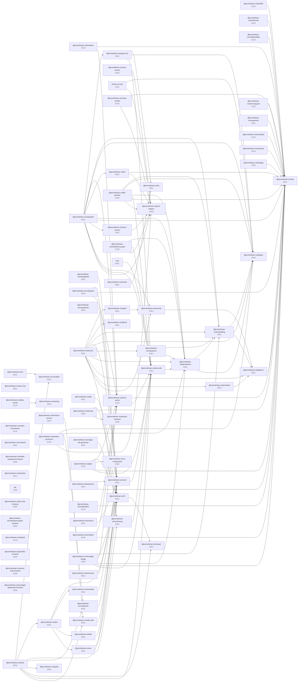

<!-- READMEFLOW:BEGIN -->
# @promethean-os/utils

[TOC]

## Install

pnpm add @promethean-os/utils

## Usage

(coming soon)

## License

GPLv3

### Package graph

```mermaid
flowchart LR
  _promethean_agent["@promethean-os/agent\n0.0.1"]
  _promethean_agent_ecs["@promethean-os/agent-ecs\n0.0.1"]
  _promethean_alias_rewrite["@promethean-os/alias-rewrite\n0.1.0"]
  _promethean_auth_service["@promethean-os/auth-service\n0.1.0"]
  _promethean_ava_mcp["@promethean-os/ava-mcp\n0.0.1"]
  _promethean_boardrev["@promethean-os/boardrev\n0.1.0"]
  broker_service["broker-service\n0.0.1"]
  _promethean_buildfix["@promethean-os/buildfix\n0.1.0"]
  _promethean_cephalon["@promethean-os/cephalon\n0.0.1"]
  _promethean_changefeed["@promethean-os/changefeed\n0.0.1"]
  _promethean_cli["@promethean-os/cli\n0.0.1"]
  _promethean_codemods["@promethean-os/codemods\n0.1.0"]
  _promethean_codepack["@promethean-os/codepack\n0.1.0"]
  _promethean_codex_context["@promethean-os/codex-context\n0.1.0"]
  _promethean_codex_orchestrator["@promethean-os/codex-orchestrator\n0.1.0"]
  _promethean_compaction["@promethean-os/compaction\n0.0.1"]
  _promethean_compiler["@promethean-os/compiler\n0.0.1"]
  _promethean_contracts["@promethean-os/contracts\n0.0.1"]
  _promethean_cookbookflow["@promethean-os/cookbookflow\n0.1.0"]
  _promethean_dev["@promethean-os/dev\n0.0.1"]
  _promethean_discord["@promethean-os/discord\n0.0.1"]
  _promethean_dlq["@promethean-os/dlq\n0.0.1"]
  _promethean_docops["@promethean-os/docops\n0.0.0"]
  _promethean_docops_frontend["@promethean-os/docops-frontend\n0.0.0"]
  _promethean_ds["@promethean-os/ds\n0.0.1"]
  _promethean_effects["@promethean-os/effects\n0.0.1"]
  _promethean_embedding["@promethean-os/embedding\n0.0.1"]
  _promethean_event["@promethean-os/event\n0.0.1"]
  _promethean_examples["@promethean-os/examples\n0.0.1"]
  _promethean_file_watcher["@promethean-os/file-watcher\n0.1.0"]
  _promethean_frontend_service["@promethean-os/frontend-service\n0.0.1"]
  _promethean_fs["@promethean-os/fs\n0.0.1"]
  _promethean_health_dashboard_frontend["@promethean-os/health-dashboard-frontend\n0.0.0"]
  _promethean_http["@promethean-os/http\n0.0.1"]
  _promethean_image_link_generator["@promethean-os/image-link-generator\n0.0.1"]
  _promethean_intention["@promethean-os/intention\n0.0.1"]
  _promethean_kanban_processor["@promethean-os/kanban-processor\n0.1.0"]
  _promethean_legacy["@promethean-os/legacy\n0.0.0"]
  _promethean_level_cache["@promethean-os/level-cache\n0.1.0"]
  lith["lith\n1.0.0"]
  _promethean_llm["@promethean-os/llm\n0.0.1"]
  _promethean_llm_chat_frontend["@promethean-os/llm-chat-frontend\n0.0.0"]
  _promethean_markdown["@promethean-os/markdown\n0.0.1"]
  _promethean_markdown_graph["@promethean-os/markdown-graph\n0.1.0"]
  _promethean_markdown_graph_frontend["@promethean-os/markdown-graph-frontend\n0.0.0"]
  mcp["mcp\n0.0.1"]
  _promethean_migrations["@promethean-os/migrations\n0.0.1"]
  _promethean_monitoring["@promethean-os/monitoring\n0.0.1"]
  _promethean_naming["@promethean-os/naming\n0.0.1"]
  _promethean_nitpack["@promethean-os/nitpack\n0.1.0"]
  _promethean_parity["@promethean-os/parity\n0.0.1"]
  _promethean_persistence["@promethean-os/persistence\n0.0.1"]
  _promethean_piper["@promethean-os/piper\n0.1.0"]
  _promethean_platform["@promethean-os/platform\n0.0.1"]
  _promethean_pm2_helpers["@promethean-os/pm2-helpers\n0.0.0"]
  _promethean_portfolio_frontend["@promethean-os/portfolio-frontend\n0.0.0"]
  _promethean_projectors["@promethean-os/projectors\n0.0.1"]
  _promethean_providers["@promethean-os/providers\n0.0.1"]
  _promethean_readmeflow["@promethean-os/readmeflow\n0.1.0"]
  _promethean_schema["@promethean-os/schema\n0.0.1"]
  _promethean_security["@promethean-os/security\n0.0.1"]
  _promethean_semverguard["@promethean-os/semverguard\n0.1.0"]
  _promethean_simtasks["@promethean-os/simtasks\n0.1.0"]
  _promethean_smart_chat_frontend["@promethean-os/smart-chat-frontend\n0.0.0"]
  _promethean_smartgpt_bridge["@promethean-os/smartgpt-bridge\n1.0.0"]
  _promethean_smartgpt_dashboard_frontend["@promethean-os/smartgpt-dashboard-frontend\n0.0.0"]
  _promethean_snapshots["@promethean-os/snapshots\n0.0.1"]
  _promethean_sonarflow["@promethean-os/sonarflow\n0.1.0"]
  _promethean_stream["@promethean-os/stream\n0.0.1"]
  _promethean_symdocs["@promethean-os/symdocs\n0.1.0"]
  _promethean_test_utils["@promethean-os/test-utils\n0.0.1"]
  _promethean_testgap["@promethean-os/testgap\n0.1.0"]
  _promethean_tests["@promethean-os/tests\n0.0.1"]
  _promethean_timetravel["@promethean-os/timetravel\n0.0.1"]
  _promethean_ui_components["@promethean-os/ui-components\n0.0.0"]
  _promethean_utils["@promethean-os/utils\n0.0.1"]
  _promethean_voice_service["@promethean-os/voice-service\n0.0.1"]
  _promethean_web_utils["@promethean-os/web-utils\n0.0.1"]
  _promethean_worker["@promethean-os/worker\n0.0.1"]
  _promethean_ws["@promethean-os/ws\n0.0.1"]
  _promethean_agent --> _promethean_security
  _promethean_agent_ecs --> _promethean_ds
  _promethean_agent_ecs --> _promethean_legacy
  _promethean_agent_ecs --> _promethean_test_utils
  _promethean_alias_rewrite --> _promethean_naming
  _promethean_auth_service --> _promethean_pm2_helpers
  _promethean_boardrev --> _promethean_utils
  _promethean_boardrev --> _promethean_level_cache
  broker_service --> _promethean_legacy
  broker_service --> _promethean_pm2_helpers
  _promethean_buildfix --> _promethean_utils
  _promethean_cephalon --> _promethean_agent_ecs
  _promethean_cephalon --> _promethean_embedding
  _promethean_cephalon --> _promethean_level_cache
  _promethean_cephalon --> _promethean_legacy
  _promethean_cephalon --> _promethean_llm
  _promethean_cephalon --> _promethean_persistence
  _promethean_cephalon --> _promethean_utils
  _promethean_cephalon --> _promethean_voice_service
  _promethean_cephalon --> _promethean_security
  _promethean_cephalon --> _promethean_test_utils
  _promethean_cephalon --> _promethean_pm2_helpers
  _promethean_changefeed --> _promethean_event
  _promethean_cli --> _promethean_compiler
  _promethean_codemods --> _promethean_utils
  _promethean_codepack --> _promethean_fs
  _promethean_codepack --> _promethean_utils
  _promethean_codepack --> _promethean_level_cache
  _promethean_codex_context --> _promethean_utils
  _promethean_codex_context --> _promethean_pm2_helpers
  _promethean_compaction --> _promethean_event
  _promethean_cookbookflow --> _promethean_utils
  _promethean_dev --> _promethean_event
  _promethean_dev --> _promethean_examples
  _promethean_dev --> _promethean_http
  _promethean_dev --> _promethean_ws
  _promethean_discord --> _promethean_agent
  _promethean_discord --> _promethean_effects
  _promethean_discord --> _promethean_embedding
  _promethean_discord --> _promethean_event
  _promethean_discord --> _promethean_legacy
  _promethean_discord --> _promethean_migrations
  _promethean_discord --> _promethean_persistence
  _promethean_discord --> _promethean_platform
  _promethean_discord --> _promethean_providers
  _promethean_discord --> _promethean_monitoring
  _promethean_discord --> _promethean_security
  _promethean_dlq --> _promethean_event
  _promethean_docops --> _promethean_fs
  _promethean_docops --> _promethean_utils
  _promethean_docops --> _promethean_docops_frontend
  _promethean_embedding --> _promethean_legacy
  _promethean_embedding --> _promethean_platform
  _promethean_event --> _promethean_test_utils
  _promethean_examples --> _promethean_event
  _promethean_file_watcher --> _promethean_embedding
  _promethean_file_watcher --> _promethean_legacy
  _promethean_file_watcher --> _promethean_persistence
  _promethean_file_watcher --> _promethean_test_utils
  _promethean_file_watcher --> _promethean_utils
  _promethean_file_watcher --> _promethean_pm2_helpers
  _promethean_frontend_service --> _promethean_web_utils
  _promethean_fs --> _promethean_stream
  _promethean_http --> _promethean_event
  _promethean_image_link_generator --> _promethean_fs
  _promethean_kanban_processor --> _promethean_legacy
  _promethean_kanban_processor --> _promethean_markdown
  _promethean_kanban_processor --> _promethean_persistence
  _promethean_kanban_processor --> _promethean_pm2_helpers
  _promethean_level_cache --> _promethean_utils
  _promethean_level_cache --> _promethean_test_utils
  _promethean_llm --> _promethean_utils
  _promethean_llm --> _promethean_pm2_helpers
  _promethean_markdown --> _promethean_fs
  _promethean_markdown_graph --> _promethean_persistence
  _promethean_markdown_graph --> _promethean_test_utils
  _promethean_markdown_graph --> _promethean_pm2_helpers
  mcp --> _promethean_test_utils
  _promethean_migrations --> _promethean_embedding
  _promethean_migrations --> _promethean_persistence
  _promethean_monitoring --> _promethean_test_utils
  _promethean_persistence --> _promethean_embedding
  _promethean_persistence --> _promethean_legacy
  _promethean_piper --> _promethean_fs
  _promethean_piper --> _promethean_level_cache
  _promethean_piper --> _promethean_ui_components
  _promethean_piper --> _promethean_utils
  _promethean_piper --> _promethean_test_utils
  _promethean_platform --> _promethean_utils
  _promethean_projectors --> _promethean_event
  _promethean_projectors --> _promethean_utils
  _promethean_providers --> _promethean_platform
  _promethean_readmeflow --> _promethean_utils
  _promethean_readmeflow --> _promethean_level_cache
  _promethean_schema --> _promethean_event
  _promethean_security --> _promethean_platform
  _promethean_semverguard --> _promethean_utils
  _promethean_simtasks --> _promethean_level_cache
  _promethean_simtasks --> _promethean_utils
  _promethean_smartgpt_bridge --> _promethean_embedding
  _promethean_smartgpt_bridge --> _promethean_fs
  _promethean_smartgpt_bridge --> _promethean_level_cache
  _promethean_smartgpt_bridge --> _promethean_persistence
  _promethean_smartgpt_bridge --> _promethean_utils
  _promethean_smartgpt_bridge --> _promethean_test_utils
  _promethean_snapshots --> _promethean_utils
  _promethean_sonarflow --> _promethean_utils
  _promethean_symdocs --> _promethean_utils
  _promethean_test_utils --> _promethean_persistence
  _promethean_testgap --> _promethean_utils
  _promethean_tests --> _promethean_compiler
  _promethean_tests --> _promethean_dev
  _promethean_tests --> _promethean_fs
  _promethean_tests --> _promethean_markdown
  _promethean_tests --> _promethean_parity
  _promethean_tests --> _promethean_stream
  _promethean_tests --> _promethean_test_utils
  _promethean_tests --> _promethean_web_utils
  _promethean_timetravel --> _promethean_event
  _promethean_voice_service --> _promethean_pm2_helpers
  _promethean_web_utils --> _promethean_fs
  _promethean_worker --> _promethean_ds
  _promethean_ws --> _promethean_event
  _promethean_ws --> _promethean_monitoring
```

<!-- READMEFLOW:END -->
